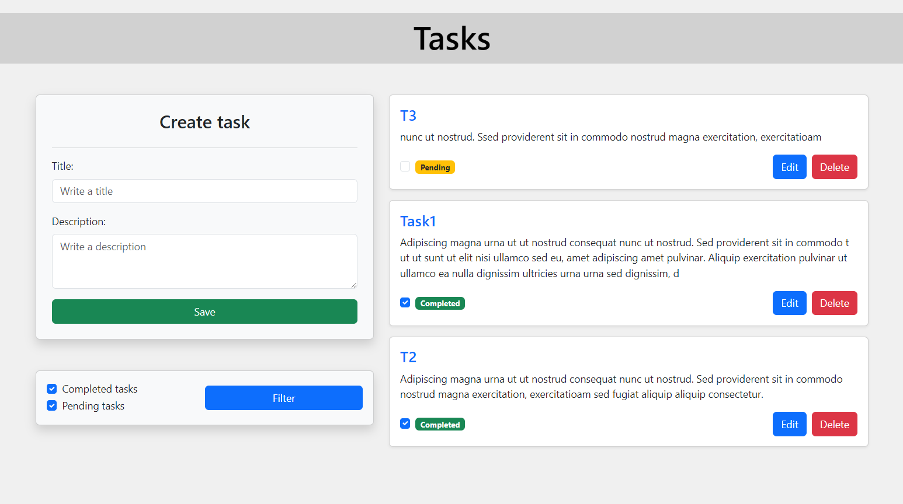

# <h1 align="center">Tasks App</h1>

Aplicación web de lista de tareas desarrollada con Django para el proyecto final de la Python en la Universidad Autonoma de Baja California. Utiliza una base de datos PostgreSQL para almacenar y gestionar las tareas.

## <h2 align="center">Pagina Principal:</h2>


## Características

- **Agregar Tareas**: Permite a los usuarios agregar nuevas tareas a la lista.
- **Visualización de Tareas**: Los usuarios pueden ver todas las tareas en la lista.
- **Edición de Tareas**: Permite a los usuarios editar las tareas existentes.
- **Eliminación de Tareas**: Los usuarios pueden eliminar las tareas de la lista.
- **Marcar como Completada**: Los usuarios pueden marcar una tarea como completada o volver a marcarla como pendiente según sea necesario.
- **Filtrado de Tareas**: Los usuarios pueden filtrar las tareas según su estado (Completada o Pendiente), mostrando solo aquellas que necesitan ver en un momento dado.
- **Indicador de estado**: Podrás visualizar el estado de cada tarea, en la esquina inferior izquierda, facilitando la identificación visual rápida de su estado actual.
- **Registro y Autenticación de Usuarios**: Los usuarios pueden registrarse, iniciar sesión y cerrar sesión.
- **Redirección después de Login/Logout**: Redirección automática a la lista de tareas después de iniciar sesión y a la página de login después de cerrar sesión.

## Requisitos

- Python 
- Django
- PostgreSQL
- psycopg2 (para la conexión de Django con PostgreSQL)

## Instalación

1. Clona este repositorio:
    ```sh
    git clone 
    cd tasks-app
    ```

2. Crea un entorno virtual e instálalo:
    ```sh
    python -m venv venv
    source venv/bin/activate  # En Windows usa `venv\Scripts\activate`
    ```

3. Instala las dependencias:
    ```sh
    pip install -r requirements.txt
    ```

4. Configura la base de datos PostgreSQL.
    - Crea una base de datos en PostgreSQL.
    - Configura tus credenciales de la base de datos en `settings.py`:

    ```python
    DATABASES = {
        'default': {
            'ENGINE': 'django.db.backends.postgresql',
            'NAME': 'tasksapp',
            'USER': 'tu_usuario_postgres',
            'PASSWORD': 'tu_password_postgres',
            'HOST': 'localhost',
            'PORT': '5432',
        }
    }
    ```

5. Aplica las migraciones para configurar la base de datos:
    ```sh
    python manage.py makemigrations
    python manage.py migrate
    ```

6. Inicia el servidor de desarrollo:
    ```sh
    python manage.py runserver
    ```

7. Abre tu navegador web y ve a `http://127.0.0.1:8000`.

## Tecnologías Utilizadas

- **Python**: Lenguaje de programación principal del proyecto.
- **Django**: Framework web utilizado para el desarrollo de la aplicación.
- **PostgreSQL**: Sistema de gestión de base de datos relacional utilizado para almacenar y gestionar las tareas.
- **Bootstrap**: Framework front-end utilizado para el diseño y la interfaz de usuario del proyecto.
- **HTML y CSS**: Utilizados para la estructura y el estilo de las plantillas del proyecto.